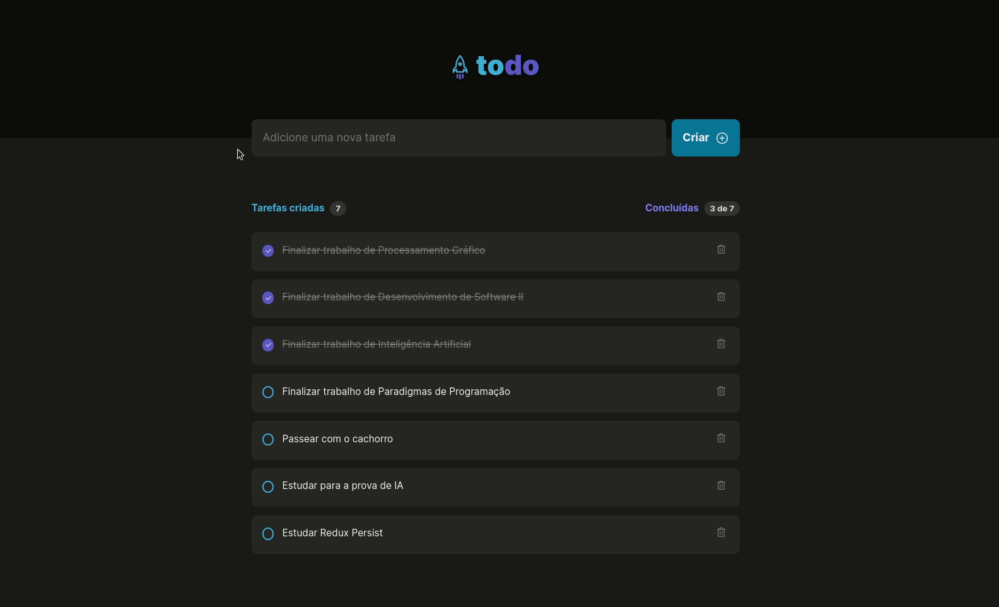

## 💻 Desafio

  

Você pode visualizar as instruções do desafio através [desse link](https://efficient-sloth-d85.notion.site/Desafio-01-Praticando-os-conceitos-do-ReactJS-91fd63dd1a5b4a2796152de293ec1074) e o layout do desafio através [desse link](https://www.figma.com/file/0n0zDN7zbzhRbaEO74Xesx/ToDo-List/duplicate).
